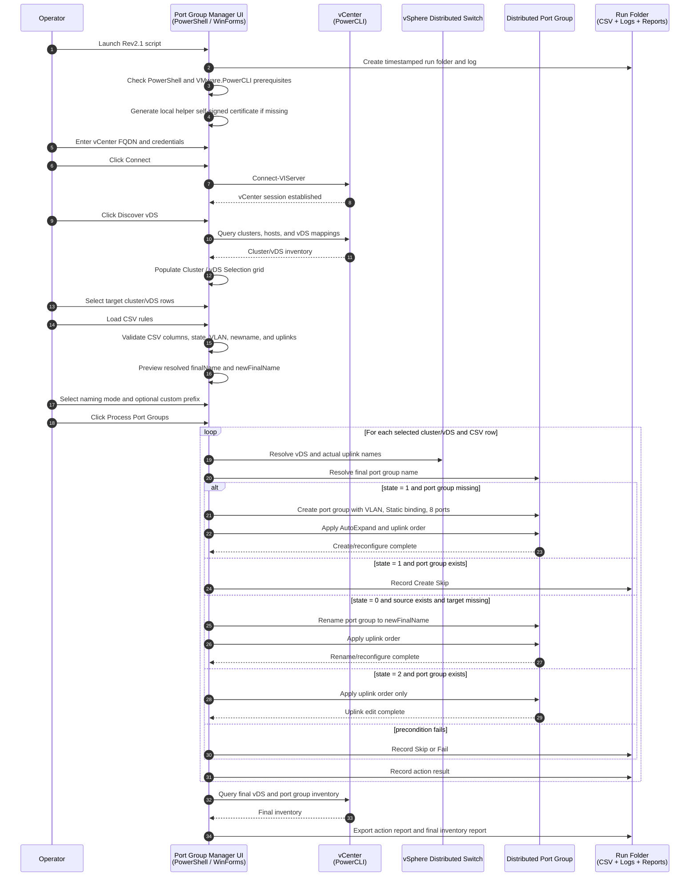

# VCF9.1-Bulk-PortGroup-Manager


**Production Version:** Rev2.1 / internal script version 2.1 
**Author:** Michael Molle  
**Runtime:** PowerShell 7+ / Windows Forms / VMware PowerCLI  
**Primary Use Case:** Bulk create, rename, edit uplink failover order, and report VMware vSphere Distributed Switch port groups from a CSV file.

## Overview

**Achieve One - Port Group Manager** is a Windows Forms PowerShell tool for safely managing VMware vSphere Distributed Switch port groups across selected vDS targets in a vCenter. The tool connects to vCenter with VMware PowerCLI, discovers cluster-to-vDS mappings, allows an operator to select the target cluster/vDS rows, imports a CSV rule file, and processes create, rename, or uplink-edit actions based on the requested state.

Rev2.1 expands the original CSV-driven create workflow with safer rename behavior, uplink failover-order management, support for two-uplink and four-uplink designs, and an improved CSV preview that shows resolved port group names based on the selected naming mode and discovered cluster name.

## Key Capabilities

### vCenter and PowerCLI Integration

- Connects to a single vCenter using VMware PowerCLI.
- Discovers clusters and vSphere Distributed Switches visible to ESXi hosts in each cluster.
- Displays discovered cluster/vDS mappings in a selectable grid.
- Allows operators to choose only the cluster/vDS rows that should be modified.
- Uses actual vDS uplink names from the vDS uplink port policy when configuring teaming and failover.
- Keeps credentials in memory only for the active session.

### CSV-Driven Port Group Actions

The CSV file requires these columns:

```csv
name,vlan,state,newname,uplink1,uplink2,uplink3,uplink4
```

Example:

```csv
name,vlan,state,newname,uplink1,uplink2,uplink3,uplink4
APP_WEB,120,1,,Active1,Active2,,
APP_DB,121,1,,Active1,Standby1,,
OLD_NETWORK,,0,RENAMED_NETWORK,Active1,Active2,,
EXISTING_NETWORK,,2,,Active2,Active1,,
FOUR_UPLINK_EXAMPLE,130,1,,Active1,Active2,Standby1,Unused
```

Column behavior:

- `name` - Source/base port group name.
- `vlan` - VLAN ID used for create rows. VLAN can be blank for rename and uplink-only edit rows.
- `state` - Requested action.
  - `1` creates the port group when it does not already exist.
  - `0` renames an existing port group. `newname` is required.
  - `2` edits uplink teaming/failover order on an existing port group only.
- `newname` - Required only when `state = 0`. Must be blank for `state = 1` and `state = 2`.
- `uplink1` through `uplink4` - Controls Active, Standby, and Unused uplink order.

## State Behavior

### `state = 1` - Create

Create mode creates the resolved port group name when it is missing. If the resolved port group already exists, the script skips the row and logs a message recommending `state = 2` if the operator wants to change uplink settings on an existing port group.

Create rows must have:

- A valid VLAN ID.
- Blank `newname`.
- At least one Active uplink.

Newly created port groups are configured with:

- Static binding.
- Elastic / AutoExpand enabled.
- 8 initial ports.
- VLAN ID from the CSV `vlan` column.
- Teaming and failover order based on `uplink1` through `uplink4`.

### `state = 0` - Rename

Rename mode replaces the previous delete behavior. This was changed because delete behavior was considered too risky for production use.

Rename rows must have:

- Existing source name in `name`.
- Target name in `newname`.
- At least one Active uplink.

Rename behavior:

- If the source port group is missing, the script skips the row.
- If the target/new port group name already exists, the script fails the row to avoid a naming collision.
- If the source exists and the target does not exist, the script renames the port group and applies the requested uplink order.

### `state = 2` - Edit Uplinks Only

Edit mode assumes the port group already exists. It does not create, delete, or rename anything.

Edit rows must have:

- Existing port group name in `name`.
- Blank `newname`.
- At least one Active uplink.

Edit behavior:

- If the port group is missing, the script records a failure because `state = 2` assumes the object exists.
- If the port group exists, the script updates only the teaming/failover uplink order.

## Port Group Naming Modes

The UI includes a **Port Group Naming** dropdown with three choices:

- **No Prefix** - uses the CSV `name` value exactly as the port group name.
- **Append Cluster Name** - creates names in this format: `<ClusterName>-<name>`.
- **Custom** - enables a custom prefix field and creates names in this format: `<CustomPrefix>-<name>`.

The naming mode applies to both `name` and `newname`. For example, if **Append Cluster Name** is selected and the cluster is `pod01mgmt-cl01`, then:

```text
name=APP_WEB      -> pod01mgmt-cl01-APP_WEB
newname=APP_WEB2 -> pod01mgmt-cl01-APP_WEB2
```

## Uplink Ordering Syntax

Each uplink column can contain one of these values:

```text
Active
Standby
Unused
Active1
Active2
Active3
Active4
Standby1
Standby2
Standby3
Standby4
```

Blank values are treated as `Unused`, so two-uplink customers can leave `uplink3` and `uplink4` blank.

### Ordering Examples

Place Uplink 1 first and Uplink 2 second under Active:

```csv
uplink1,uplink2,uplink3,uplink4
Active1,Active2,,
```

Place Uplink 2 first and Uplink 1 second under Active:

```csv
uplink1,uplink2,uplink3,uplink4
Active2,Active1,,
```

Place Uplink 1 Active and Uplink 2 Standby:

```csv
uplink1,uplink2,uplink3,uplink4
Active1,Standby1,,
```

Four-uplink example:

```csv
uplink1,uplink2,uplink3,uplink4
Active1,Active2,Standby1,Unused
```

## CSV Preview Behavior

The CSV preview grid now shows both the raw CSV values and resolved names:

- `name`
- `finalName`
- `vlan`
- `state`
- `newname`
- `newFinalName`
- `uplink1`
- `uplink2`
- `uplink3`
- `uplink4`

The preview resolves names based on the selected naming mode. For cluster-prefixed naming, the preview uses the first selected discovered cluster. If no cluster/vDS row is selected, the preview uses the first discovered cluster. If discovery has not run, the preview shows `<discover/select cluster>`.

## Reporting

Each run writes output to a timestamped run folder. Reports include:

- Action report CSV.
- Action report HTML.
- Final vDS/port group inventory CSV.
- Runtime log file.

The final inventory report includes key validation columns such as vCenter, datacenter, cluster, switch, port group, VLAN, number of ports, binding, AutoExpand, and uplink order.

## Generated Files

Each run creates a timestamped output folder similar to:

```text
vDSPortGroup-Run-yyyyMMdd-HHmmss
```

Typical files include:

```text
vDSPortGroup-yyyyMMdd-HHmmss.log
PortGroup-Actions.csv
PortGroup-Actions.html
Final-vDS-PortGroup-Report-yyyyMMdd-HHmmss.csv
```

## End-to-End Workflow



## Prerequisites

### Workstation

- Windows workstation or management VM.
- PowerShell 7+ recommended.
- Windows Forms support.
- Network reachability to the target vCenter.

### PowerShell Modules

Required module:

```powershell
VMware.PowerCLI
```

The UI includes buttons to recheck prerequisites and install VMware.PowerCLI for the current user when needed.

### vSphere Permissions

The connecting account should have permission to:

- Read datacenters, clusters, hosts, and distributed switches.
- Read distributed port groups.
- Create distributed port groups.
- Rename/reconfigure distributed port groups.
- Edit distributed port group teaming and failover settings.

## How to Run

Launch from PowerShell:

```powershell
pwsh.exe -ExecutionPolicy Bypass -File .\VCF9.1-Bulk-PortGroup-Manager-Rev2.1.ps1
```

Recommended workflow:

1. Click **Recheck** in Prerequisites.
2. Enter vCenter FQDN and credentials.
3. Click **Connect**.
4. Click **Discover vDS** in the **Cluster / vDS Selection** section.
5. Select the cluster/vDS rows that should be modified.
6. Click **Download Example CSV** if a template is needed.
7. Fill out or load a CSV with `name`, `vlan`, `state`, `newname`, and `uplink1-uplink4` columns.
8. Select the desired **Port Group Naming** mode.
9. If **Custom** is selected, enter the custom prefix.
10. Review the CSV preview grid and confirm `finalName` and `newFinalName` resolve as expected.
11. Click **Process Port Groups**.
12. Review the Action Results grid.
13. Click **Export vDS Report** if an additional final report is needed.
14. Open the run folder and review the logs and CSV reports.

## Main UI Sections

### Prerequisites

Displays PowerShell and VMware.PowerCLI status. Includes recheck and install buttons.

### vCenter Connection

Collects vCenter FQDN, username, and password. Passwords are not saved to disk.

### Cluster / vDS Selection

Contains:

- Select All.
- Select None.
- Discover vDS.
- Cluster/vDS selection grid.

Only selected cluster/vDS rows are modified.

### CSV Rules

Contains:

- CSV path.
- Load CSV button.
- Download Example CSV button.
- Port Group Naming dropdown.
- Custom Prefix field when Custom naming is selected.
- CSV preview grid with resolved names.

### Action Results

Displays create, rename, edit uplinks, skip, and fail results for each processed CSV row.

### Log

Displays runtime log output and includes an Open Log button.

### Reports / Actions

Contains:

- Reports path.
- Browse.
- Process Port Groups.
- Export vDS Report.
- Open Run Folder.
- Close.

## Validation Behavior

Before processing, the tool validates:

- vCenter connection exists.
- At least one cluster/vDS row is selected.
- CSV file is loaded.
- CSV has required headers: `name`, `vlan`, `state`, `newname`, `uplink1`, `uplink2`, `uplink3`, and `uplink4`.
- State is `0`, `1`, or `2`.
- Create rows have a valid VLAN and blank `newname`.
- Rename rows have a required `newname`.
- Uplink-only edit rows have blank `newname`.
- Uplink values are valid.
- At least one uplink is Active.
- Custom prefix is populated when Custom naming is selected.

## Troubleshooting

### VMware.PowerCLI is not found

Click **Install PowerCLI** or install manually:

```powershell
Install-Module VMware.PowerCLI -Scope CurrentUser -Force -AllowClobber
```

Close and reopen PowerShell if PowerCLI module import conflicts occur.

### Discover vDS returns no rows

Verify:

- vCenter connection succeeded.
- The connecting account can read clusters, hosts, and vDS objects.
- ESXi hosts are attached to distributed switches.

### CSV load fails

Confirm the CSV headers are exactly:

```csv
name,vlan,state,newname,uplink1,uplink2,uplink3,uplink4
```

Confirm state values are `0`, `1`, or `2`. Confirm create rows have VLAN IDs within the valid range.

### Rename skipped or failed

Rename skips when the source port group is missing. Rename fails when the target `newname` already exists on the selected vDS. Confirm the selected naming mode resolves source and target names correctly.

### Uplink edit fails

Confirm the port group exists when using `state = 2`. Confirm at least one uplink is Active. Confirm the connecting account has permission to reconfigure distributed port group policies.

### Uplink order is not as expected

Use numbered values such as `Active1`, `Active2`, `Standby1`, and `Standby2` to control ordering. The script uses the vDS uplink port policy names where available, so confirm the vDS uplink names map to the expected uplinks.

### Created port group does not show 8 ports or AutoExpand

Review the action grid and log. If the create succeeded but the reconfigure task failed, the action result will record a failure message. Confirm the account has permission to reconfigure distributed port groups.

## Security Notes

- vCenter passwords are not written to disk.
- The run folder may contain environment-specific inventory data.
- Store reports and logs securely.
- Review CSV input carefully before running changes.
- Run the tool from a controlled administrative workstation.

## License

Internal use. Provide attribution if reused or modified.

