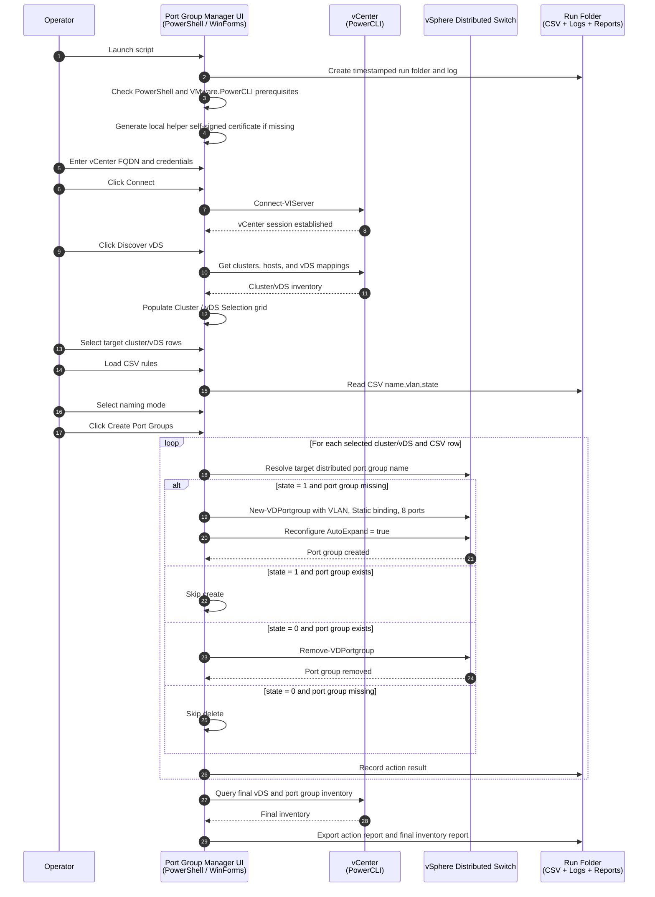

# VCF9.1-Bulk-PortGroup-Manager
VCF 9.1 Bulk Create and Delete vDS Port Group Manager UI


**Production Version:** Rev1.1 / v1.0.6 internal script version  
**Author:** Michael Molle  
**Runtime:** PowerShell 7+ / Windows Forms / VMware PowerCLI  
**Primary Use Case:** Bulk create, delete, and report VMware vSphere Distributed Switch port groups from a simple CSV input file.

## Overview

Achieve One - Port Group Manager is a Windows Forms PowerShell tool for safely managing distributed port groups across selected vDS targets in a vCenter. The tool connects to vCenter with VMware PowerCLI, discovers cluster-to-vDS mappings, allows an operator to select the target cluster/vDS rows, imports a CSV rule file, and then creates or removes distributed port groups based on the requested state.

The script supports flexible port group naming, including no prefix, cluster-name prefix, or a custom prefix. Newly created distributed port groups are configured with Static binding, Elastic auto-expand, and 8 initial ports. The tool also exports action results and a final vDS/port group inventory report.

## Key Capabilities

### vCenter and PowerCLI Integration

- Connects to a single vCenter using VMware PowerCLI.
- Discovers clusters and vSphere Distributed Switches visible to ESXi hosts in each cluster.
- Displays discovered cluster/vDS mappings in a selectable grid.
- Allows operators to choose only the cluster/vDS rows that should be modified.
- Keeps credentials in memory only for the active session.

### CSV-Driven Port Group Actions

The CSV file requires exactly these columns:

```csv
name,vlan,state
APP_WEB,120,1
APP_DB,121,1
OLD_NETWORK,999,0
```

Column behavior:

- `name` - Base port group name.
- `vlan` - VLAN ID to assign when creating the port group.
- `state` - Desired action.
  - `1` creates the port group when the port group does not already exist.
  - `0` deletes the port group when the port group exists.

### Port Group Naming Modes

The UI includes a **Port Group Naming** dropdown with three choices:

- **No Prefix** - uses the CSV `name` value exactly as the port group name.
- **Append Cluster Name** - creates names in this format: `<ClusterName>-<name>`.
- **Custom** - enables a custom prefix field and creates names in this format: `<CustomPrefix>-<name>`.

### Creation Defaults

Newly created port groups are configured with:

- Static binding.
- Elastic / auto-expand enabled.
- 8 initial ports.
- VLAN ID from the CSV `vlan` column.

If a requested create target already exists, the script skips the create action and records a skip result.

### Delete Behavior

For CSV rows where `state = 0`:

- If the resolved port group exists, the script deletes the port group.
- If the resolved port group does not exist, the script skips the action and records a skip result.

### Reporting

Each run writes output to a timestamped run folder. Reports include:

- Action report CSV.
- Action report HTML.
- Final vDS/port group inventory CSV.
- Runtime log file.

The final inventory report includes key validation columns such as vCenter, datacenter, cluster, switch, port group, VLAN, number of ports, binding, and AutoExpand.

## Version 1.0.6 / Rev1.1 Change Summary

- Added port group naming dropdown: No Prefix, Append Cluster Name, and Custom.
- Moved **Discover vDS** into the **Cluster / vDS Selection** section.
- Renamed the primary action button to **Create Port Groups**.
- Cleaned up the window title to **Achieve One - Port Group Manager**.
- Ensured newly created port groups use Static binding, Elastic auto-expand, and 8 initial ports.
- Added AutoExpand to the final vDS report.
- Kept the dark Achieve One UI style.
- Continued generating a local helper self-signed certificate on launch without surfacing certificate settings in the prerequisites UI.

## Generated Files

Each run creates a timestamped output folder similar to:

```text
vDSPortGroup-Run-yyyyMMdd-HHmmss
```

Typical files include:

```text
vDSPortGroup-yyyyMMdd-HHmmss.log
PortGroup-Actions.csv
PortGroup-Actions.html
Final-vDS-PortGroup-Report-yyyyMMdd-HHmmss.csv
```

## End-to-End Workflow



## Prerequisites

### Workstation

- Windows workstation or management VM.
- PowerShell 7+ recommended.
- Windows Forms support.
- Network reachability to the target vCenter.

### PowerShell Modules

Required module:

```powershell
VMware.PowerCLI
```

The UI includes buttons to recheck prerequisites and install VMware.PowerCLI for the current user when needed.

### vSphere Permissions

The connecting account should have permission to:

- Read datacenters, clusters, hosts, and distributed switches.
- Read distributed port groups.
- Create distributed port groups.
- Reconfigure distributed port groups.
- Delete distributed port groups.

## How to Run

Launch from PowerShell:

```powershell
pwsh.exe -ExecutionPolicy Bypass -File .\VCF9.1-Bulk-PortGroup-Manager-Rev1.1.ps1
```

Recommended workflow:

1. Click **Recheck** in Prerequisites.
2. Enter vCenter FQDN and credentials.
3. Click **Connect**.
4. Click **Discover vDS** in the **Cluster / vDS Selection** section.
5. Select the cluster/vDS rows that should be modified.
6. Click **Download Example CSV** if a template is needed.
7. Fill out or load a CSV with `name`, `vlan`, and `state` columns.
8. Select the desired **Port Group Naming** mode.
9. If **Custom** is selected, enter the custom prefix.
10. Click **Create Port Groups**.
11. Review the action results grid.
12. Click **Export vDS Report** if an additional final report is needed.
13. Open the run folder and review the logs and CSV reports.

## Main UI Sections

### Prerequisites

Displays PowerShell and VMware.PowerCLI status. Includes recheck and install buttons.

### vCenter Connection

Collects vCenter FQDN, username, and password. Passwords are not saved to disk.

### Cluster / vDS Selection

Contains:

- Select All.
- Select None.
- Discover vDS.
- Cluster/vDS selection grid.

Only selected cluster/vDS rows are modified.

### CSV Rules

Contains:

- CSV path.
- Load CSV button.
- Download Example CSV button.
- Port Group Naming dropdown.
- Custom Prefix field when Custom naming is selected.
- CSV preview grid.

### Action Results

Displays create, delete, skip, and fail results for each processed CSV row.

### Log

Displays runtime log output and includes an Open Log button.

### Reports / Actions

Contains:

- Reports path.
- Browse.
- Create Port Groups.
- Export vDS Report.
- Open Run Folder.
- Close.

## Validation Behavior

Before processing, the tool validates:

- vCenter connection exists.
- At least one cluster/vDS row is selected.
- CSV file is loaded.
- CSV has required headers: `name`, `vlan`, and `state`.
- VLAN is numeric and between 0 and 4094.
- State is either `0` or `1`.
- Custom prefix is populated when Custom naming is selected.

## Troubleshooting

### VMware.PowerCLI is not found

Click **Install PowerCLI** or install manually:

```powershell
Install-Module VMware.PowerCLI -Scope CurrentUser -Force -AllowClobber
```

Close and reopen PowerShell if PowerCLI module import conflicts occur.

### Discover vDS returns no rows

Verify:

- vCenter connection succeeded.
- The connecting account can read clusters, hosts, and vDS objects.
- ESXi hosts are attached to distributed switches.

### CSV load fails

Confirm the CSV headers are exactly:

```csv
name,vlan,state
```

Confirm `state` is `0` or `1`, and VLAN IDs are within the valid range.

### Port group already exists

Create actions skip existing port groups by design. Delete or rename the existing port group if a replacement is required.

### Delete skipped

Delete actions skip missing port groups by design. Confirm the selected naming mode resolves to the expected name.

### Created port group does not show 8 ports or AutoExpand

Review the action grid and log. If the create succeeded but the reconfigure task failed, the action result will record a failure message. Confirm the account has permission to reconfigure distributed port groups.

## Security Notes

- vCenter passwords are not written to disk.
- The run folder may contain environment-specific inventory data.
- Store reports and logs securely.
- Review CSV input carefully before running changes.
- Run the tool from a controlled administrative workstation.

## License

Internal use. Provide attribution if reused or modified.
